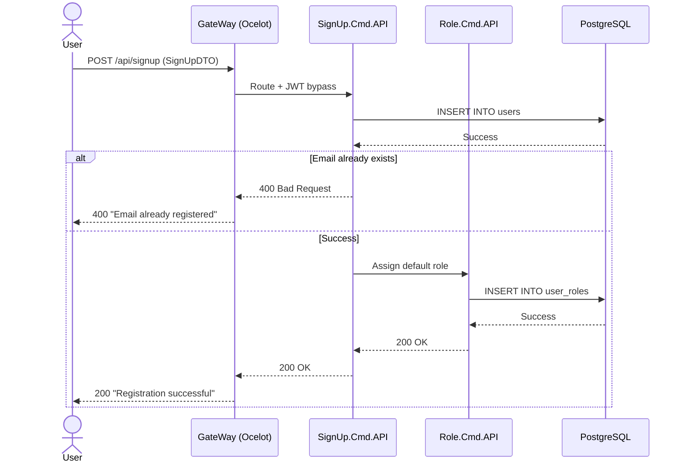

# Integration Test Flow

Generate an integration test flow diagram and test plan for the specified end-to-end scenario.

**Flow to test**: {{flow description}}

## ⚠️ Controller 整合測試規範（必讀）

Controller 整合測試的價值在於驗證 **Auth、路由、Model Validation**，而非業務邏輯。

### ✅ 應生成的情境

| 情境 | 測試什麼 | 預期結果 |
|------|----------|----------|
| 未帶 JWT token 呼叫 | Auth middleware | `401 Unauthorized` |
| 帶了 token 但角色不符（如非 Admin） | Authorize attribute | `403 Forbidden` |
| 缺少 `[Required]` 欄位 | Model validation | `400 Bad Request` |
| Route parameter 格式錯誤 | Route binding | `400 Bad Request` |

### ⛔ 禁止的測試模式

```csharp
// ❌ 禁止：Mock 整個 Dispatcher 然後斷言成功狀態碼
_factory.MockDispatcher
    .Setup(x => x.SendAsync(It.IsAny<BaseCommand>()))
    .ReturnsAsync(new TResult { isSuccess = true });
var response = await _adminClient.PostAsJsonAsync(...);
response.StatusCode.ShouldBe(HttpStatusCode.Created); // 只是測試 ASP.NET 框架本身
```

成功路徑若要測試，必須讓整個 CQRS 鏈路真實執行（Mock `IRepository` + `IUnitOfWork`，不 Mock Dispatcher）。

## Step 1: Discover Involved Services

Search the codebase to identify:
1. Which microservices are involved (`Services/` directory)
2. Which Cmd and Query APIs participate
3. Which database tables are read/written
4. External integrations (e.g., MailService, GateWay JWT)

## Step 2: Generate Mermaid Sequence Diagram

Create a detailed sequence diagram showing:
- All service interactions in order
- Request/Response payloads at each step
- Database read/write points
- Error paths (use `alt`/`else` blocks)
- JWT/Auth checkpoints

Example structure:


## Step 3: Generate Test Plan Document

Save to `Tests/docs/{FlowName}-integration-test.md`:

```markdown
# Integration Test: {Flow Name}

> **Date**: {YYYY-MM-DD}
> **Services**: {List of services involved}

## Flow Diagram

{Mermaid diagram here}

## Test Scenarios

| # | Scenario | Steps | Expected Result | Priority |
|---|----------|-------|-----------------|----------|
| IT-1 | Happy path | 1→2→3→... | All succeed, final state correct | High |
| IT-2 | Step 2 fails | 1→2(fail) | Rollback / error response | High |
| IT-3 | Auth failure | GW rejects | 401 Unauthorized | Medium |

## Pre-conditions

- Database is seeded with: {required data}
- Services running: {service list}
- JWT token available for: {roles needed}

## Test Steps (IT-1: Happy Path)

1. **Setup**: {database seed, mock state}
2. **Action**: `POST {endpoint}` with `{payload}`
3. **Verify intermediate state**: Check {table} has {expected row}
4. **Action**: `{next step}`
5. **Final verification**: 
   - HTTP response: `200 OK` with `{expected body}`
   - Database state: {expected records}
   - Side effects: {emails sent, events published, etc.}

## Cleanup

- Tables to truncate: {list}
- Files to delete: {list}
```

## Step 4: Check for Missing Unit Tests

After defining integration test scenarios, verify:
- Each service in the flow has corresponding unit tests in `Tests/`
- Run `/generate-unit-tests` for any service missing tests

## Step 5: Generate Integration Test Logic Summary（必要產出）

**每次產生整合測試後，必須同步產出說明文件**，供作者日後閱讀與維護：

儲存至 `Tests/{ServiceName}.Test/docs/integration-test-summary.md`，格式如下：

```markdown
# {ServiceName} 整合測試說明

> **日期**：{YYYY-MM-DD}  
> **測試檔案**：`Tests/{ServiceName}.Test/Controller_CmdIntegrationTests.cs`  
> **涵蓋 API**：`{Controller route}`

## 測試範圍說明

本整合測試**僅驗證 Authorization 與 Model Validation 層**，不涵蓋業務邏輯。  
業務邏輯（DB CRUD、例外處理、Transaction）由 `EventHandlerTests.cs` 及 `QueryHandlerTests.cs` 負責。

## 測試情境索引

| # | 測試方法名稱 | 驗證目標 | HTTP 動詞 + 路由 | 預期狀態碼 |
|---|------------|---------|----------------|----------|
| 1 | `Add_UnauthenticatedRequest_Returns401Unauthorized` | 未帶 JWT token | `POST /api/v1/.../Add` | 401 |
| 2 | `Add_NonAdminRole_Returns403Forbidden` | 非 Admin 角色 | `POST /api/v1/.../Add` | 403 |
| 3 | `Add_MissingControllerId_Returns400BadRequest` | `[Required]` 驗證 | `POST /api/v1/.../Add` | 400 |
| ... | ... | ... | ... | ... |

## 測試基礎設施說明

### CustomWebApplicationFactory
- 取代 JWT Bearer 驗證為 `TestAuthHandler`
- `ICommandDispatcher` 被 Mock，僅讓請求不拋出例外（不斷言 Mock 互動）

### TestAuthHandler
- Header `X-Test-Auth: Admin` → 模擬已驗證 Admin 使用者
- Header `X-Test-Auth: User` → 模擬已驗證但非 Admin 使用者（觸發 403）
- 不帶 Header → 視為未驗證（觸發 401）

## 什麼情境未被此測試覆蓋（以及由誰覆蓋）

| 未覆蓋情境 | 覆蓋位置 |
|-----------|----------|
| 新增成功後 DB 有正確資料 | `EventHandlerTests.On_AddControllerEvent_...` |
| 找不到 Controller 時拋出例外 | `EventHandlerTests.On_UpdateControllerEvent_WhenNotFound_...` |
| 查詢回傳正確清單 | `QueryHandlerTests.HandleAsync_GetControllersQuery_...` |
```

## Output Files

1. `Tests/{ServiceName}.Test/docs/integration-test-summary.md` — **整合測試邏輯說明文件（必要）**
2. `Tests/{ServiceName}.Test/Controller_CmdIntegrationTests.cs` — 整合測試程式碼
3. `docs/tests/{ServiceName}/{Side}.IntegrationTestFlow.md` — 跨服務端到端測試流程圖（如適用，`{Side}` 為 `Cmd` 或 `Query`）
