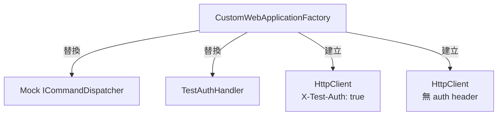
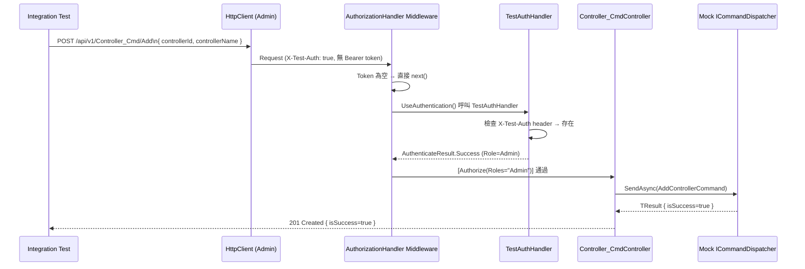
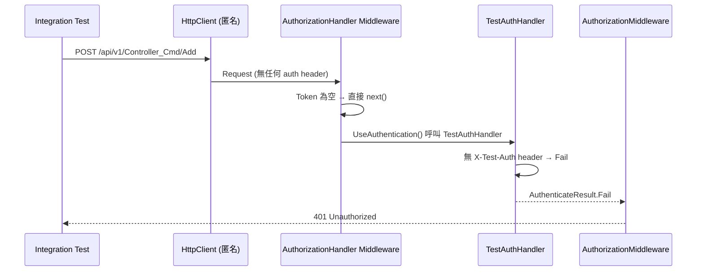
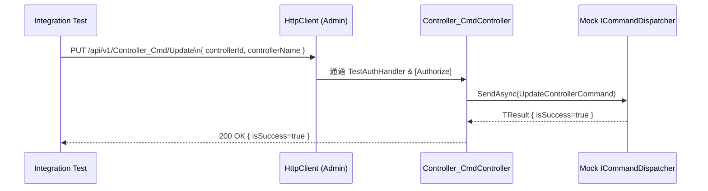
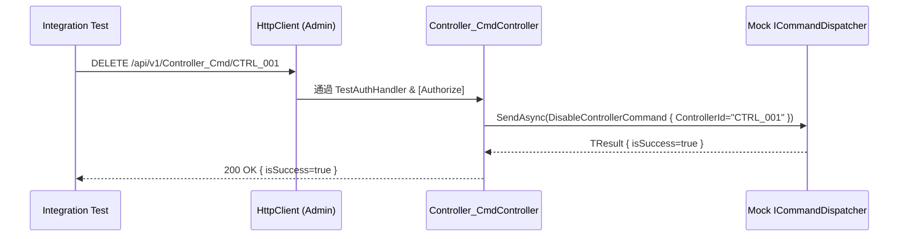

# ControllerService Cmd API — 整合測試流程圖

## 測試情境總覽

| 測試名稱 | HTTP Method | 路由 | 身份 | 預期結果 |
|---|---|---|---|---|
| Add_AuthenticatedAdmin_Returns201Created | POST | /api/v1/Controller_Cmd/Add | Admin | 201 Created |
| Add_UnauthenticatedRequest_Returns401Unauthorized | POST | /api/v1/Controller_Cmd/Add | 匿名 | 401 |
| Update_AuthenticatedAdmin_Returns200Ok | PUT | /api/v1/Controller_Cmd/Update | Admin | 200 OK |
| Update_UnauthenticatedRequest_Returns401Unauthorized | PUT | /api/v1/Controller_Cmd/Update | 匿名 | 401 |
| Disable_AuthenticatedAdmin_Returns200Ok | DELETE | /api/v1/Controller_Cmd/{id} | Admin | 200 OK |
| Disable_UnauthenticatedRequest_Returns401Unauthorized | DELETE | /api/v1/Controller_Cmd/{id} | 匿名 | 401 |

---

## 整合測試架構

---

## API 整合測試流程

### POST /Add — 已驗證 Admin

### POST /Add — 未驗證 (匿名)

### PUT /Update — 已驗證 Admin

### DELETE /{controllerId} — 已驗證 Admin

---

## 測試基礎設施說明

| 元件 | 說明 |
|---|---|
| `CustomWebApplicationFactory` | 繼承 `WebApplicationFactory<Program>`，替換 `ICommandDispatcher` 與 JWT auth |
| `TestAuthHandler` | 自訂 `AuthenticationHandler`：有 `X-Test-Auth: true` header → Admin 身份，否則 401 |
| `Mock<ICommandDispatcher>` | 暴露於 `factory.MockDispatcher`，可在每個測試中設定 Setup / Verify |
| `AdminClient` | 預設帶有 `X-Test-Auth: true` header 的 `HttpClient` |
| `AnonymousClient` | 無任何 auth header 的 `HttpClient`，用於測試 401 情境 |
